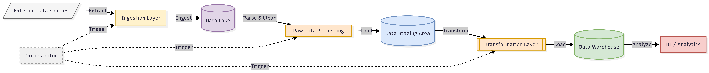

# Stock Data Pipeline

Dự án này xây dựng một hệ thống xử lý dữ liệu chứng khoán (Việt Nam) từ việc thu thập (Ingestion), lưu trữ (Data Lake/S3), truyền tải (Streaming) đến phân tích và lưu trữ tập trung (OLAP).

---

## Mục lục
- [I. Kiến trúc hệ thống (Pipeline Architecture)](#i-kiến-trúc-hệ-thống-pipeline-architecture)
- [II. Nguồn dữ liệu & API (vnstock)](#ii-nguồn-dữ-liệu--api-vnstock)
- [III. Data Staging Area](#iii-data-staging-area)
- [IV. Data Warehouse](#iv-data-warehouse)
- [V. Công nghệ sử dụng](#v-công-nghệ-sử-dụng)
- [VI. Hướng dẫn sử dụng](#vi-hướng-dẫn-sử-dụng)

---

## I. Kiến trúc hệ thống (Pipeline Architecture)

Hệ thống bao gồm các thành phần chính như sau:



1. **Ingestion (Python)**: Sử dụng thư viện `vnstock` để cào dữ liệu (danh sách ticker, giá trong ngày, giá lịch sử, metadata công ty).
2. **Streaming (Kafka)**: Truyền tải dữ liệu real-time từ các script Python sang MinIO.
3. **Data Lake (MinIO)**: Lưu trữ các tệp thô (CSV/Parquet) dưới dạng S3 compatible storage.
4. **Processing (Apache Spark - Java)**: Đọc dữ liệu từ MinIO, thực hiện biến đổi và làm sạch.
5. **Analytics / DW (ClickHouse)**: Lưu trữ dữ liệu đã xử lý để hỗ trợ truy vấn nhanh cho báo cáo/phân tích.
6. **Infrastructure (Docker)**: Toàn bộ dịch vụ được triển khai thông qua Docker Compose.

---

## II. Nguồn dữ liệu & API (vnstock)

**[vnstock](https://github.com/thinh-vu/vnstock)** là thư viện Python mã nguồn mở do **Thinh Vu** — một Data Analyst người Việt Nam — phát triển và phát hành lần đầu năm 2022. Xuất phát từ kinh nghiệm làm Data Analyst tại một nền tảng thương mại điện tử hàng đầu Việt Nam, tác giả xây dựng vnstock nhằm tự động hóa việc thu thập và phân tích dữ liệu chứng khoán — công việc trước đây phải thực hiện thủ công hàng giờ đồng hồ. Thư viện hiện đang ở trạng thái Production/Stable, hỗ trợ Python 3.10 trở lên và được phân phối với giấy phép phi thương mại.

vnstock được xây dựng với sứ mệnh **"Mang dữ liệu tài chính và công cụ đầu tư đến gần hơn với tất cả mọi người"**, liên tục tích hợp công nghệ hiện đại để không chỉ đáp ứng nhu cầu dữ liệu cơ bản mà còn giúp xây dựng các giải pháp phân tích tài chính thông minh và linh hoạt.

### Dữ liệu vnstock cung cấp

vnstock tổng hợp và cung cấp nhiều loại dữ liệu tài chính, bao gồm:

- **Giá cổ phiếu**: theo thời gian thực và lịch sử (OHLCV).
- **Chỉ số thị trường**: VNIndex, HNX-Index, UPCOM-Index.
- **Chứng quyền**: giá, ngày đáo hạn, tổ chức phát hành.
- **Hợp đồng phái sinh**: VN30F (giá, khối lượng, open interest).
- **Trái phiếu**: chính phủ và doanh nghiệp (lãi suất, kỳ hạn, khối lượng giao dịch).
- **Tỷ giá ngoại tệ**: theo thời gian thực từ nhiều ngân hàng trong nước.
- **Giá vàng**: thị trường trong nước (SJC, DOJI) và quốc tế (XAU/USD).
- **Tiền điện tử**: giá và biến động của các đồng tiền hàng đầu.
- **Tin tức & sự kiện**: tin tức tài chính và lịch sự kiện thị trường được cập nhật tự động.

### Nguồn dữ liệu phía sau

vnstock không tự lưu trữ dữ liệu mà đóng vai trò là **lớp trừu tượng thống nhất (abstraction layer)**, kết nối và chuẩn hóa dữ liệu từ các nguồn công khai uy tín:

| Nguồn      | Loại dữ liệu chính                              |
|------------|-------------------------------------------------|
| TCBS       | Giá lịch sử, intraday, báo cáo tài chính        |
| SSI        | Danh sách niêm yết, giá real-time, thống kê EOD |
| VNDirect   | Giá cổ phiếu, phái sinh, chỉ số                 |
| VPS        | Dữ liệu khớp lệnh, thống kê giao dịch           |
| KBS        | Danh bạ chứng khoán, thông tin công ty          |

Thay vì viết code scraping riêng cho từng nguồn với cấu trúc response khác nhau, pipeline chỉ cần gọi các phương thức chuẩn hóa của vnstock — giúp hệ thống dễ bảo trì và mở rộng khi nguồn dữ liệu thay đổi.

### Các module API chính trong dự án

#### i. Listing (Danh bạ chứng khoán)

Cung cấp toàn bộ danh sách mã cổ phiếu đang niêm yết trên các sàn HOSE, HNX, UPCOM. Mỗi bản ghi bao gồm các trường:

| Trường        | Mô tả                                      |
|---------------|--------------------------------------------|
| `ticker`      | Mã cổ phiếu (VD: VNM, HPG, VIC)           |
| `organName`   | Tên đầy đủ của công ty                     |
| `exchange`    | Sàn niêm yết (HOSE / HNX / UPCOM)         |
| `icbName`     | Ngành nghề theo chuẩn phân loại ICB        |
| `indexGroup`  | Thuộc nhóm chỉ số nào (VD: VN30, HNX30)   |

**Nguồn**: KBS, SSI.

#### ii. Stock Price (Giá chứng khoán)

**Historical Data** — Chuỗi giá OHLC và khối lượng giao dịch theo ngày, hỗ trợ truy xuất nhiều năm lịch sử. Schema trả về:

| Trường        | Mô tả                          |
|---------------|--------------------------------|
| `tradingDate` | Ngày giao dịch                 |
| `open`        | Giá mở cửa                     |
| `high`        | Giá cao nhất trong phiên       |
| `low`         | Giá thấp nhất trong phiên      |
| `close`       | Giá đóng cửa                   |
| `volume`      | Khối lượng khớp lệnh           |

**Intraday Data** — Dữ liệu khớp lệnh từng phút trong phiên giao dịch hiện tại. Schema trả về:

| Trường   | Mô tả                                  |
|----------|----------------------------------------|
| `t`      | Timestamp (Unix)                       |
| `p`      | Giá khớp lệnh                          |
| `volume` | Khối lượng từng lệnh                   |
| `a`      | Loại lệnh: `B` (mua) / `S` (bán)      |
| `hl`     | Trạng thái tăng/giảm so với lệnh trước |

**Daily Price** — Bảng giá cuối ngày tổng hợp cho danh sách nhiều mã cùng lúc, phù hợp với báo cáo EOD (End of Day). Trả về snapshot đầy đủ bao gồm giá tham chiếu, giá trần/sàn, dư mua/bán, tổng giá trị giao dịch.

#### iii. Fundamental & Metadata (Dữ liệu cơ bản)

**Company Metadata** — Thông tin tĩnh của doanh nghiệp:

| Trường            | Mô tả                                        |
|-------------------|----------------------------------------------|
| `organName`       | Tên công ty đầy đủ                           |
| `icbName`         | Ngành nghề theo chuẩn ICB                    |
| `marketCap`       | Vốn hóa thị trường (tỷ VND)                 |
| `sharesOutstanding` | Số lượng cổ phiếu lưu hành               |
| `exchange`        | Sàn niêm yết                                 |

**Báo cáo tài chính** — Các chỉ số định giá và hiệu quả hoạt động theo từng năm:

| Chỉ số | Mô tả                                              |
|--------|----------------------------------------------------|
| `P/E`  | Hệ số giá trên thu nhập                            |
| `P/B`  | Hệ số giá trên giá trị sổ sách                     |
| `ROE`  | Tỷ suất sinh lời trên vốn chủ sở hữu              |
| `ROA`  | Tỷ suất sinh lời trên tổng tài sản                 |
| `EPS`  | Thu nhập trên mỗi cổ phiếu                         |

Hỗ trợ so sánh chéo nhiều mã cùng ngành; dữ liệu trả về dạng bảng đa chiều với trục thời gian và mã cổ phiếu.

---

## III. Data Staging Area


---

## IV. Data Warehouse


---

## V. Công nghệ sử dụng

- **Ngôn ngữ**: Python, Java
- **Cơ sở dữ liệu quan hệ**: PostgreSQL
- **Distributed Streaming**: Apache Kafka
- **Distributed Processing**: Apache Spark
- **Data Lake**: MinIO
- **Data Warehouse**: ClickHouse
- **Workflow Orchestration**: Apache Airflow
- **Containerization**: Docker

---

## IV. Hướng dẫn sử dụng

### Bước 1. Clone dự án

```bash
git clone https://github.com/hieunt/stock-data-pipeline.git
```

### Bước 2. Chạy Docker

```bash
cd deploy
docker compose up -d
```

### Bước 3. Truy cập các dịch vụ

| Dịch vụ           | Địa chỉ                
|-------------------|------------------------|
| Spark Master UI   | http://localhost:8080  |
| MinIO Console     | http://localhost:9001  |
| ClickHouse HTTP   | http://localhost:8123  |
| ClickHouse Native | localhost:9000         |
